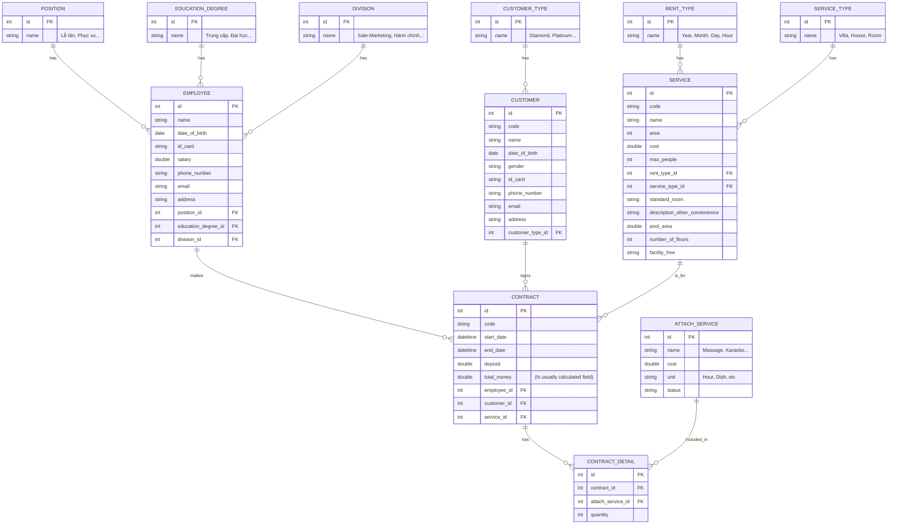

# Furama Resort Database Design

Based on the **CodeGym ReactJS Case Study v1.2** requirements.

## Entity Relationship Diagram (ERD)

## Table Detailed Descriptions

### 1. General Categories (Reference Tables)

#### POSITION (Vị trí)
- Represents employee positions.
- Data: Lễ tân, quy phục, chuyên viên, giám sát, quản lý, giám đốc.
| Column | Type | Description |
|---|---|---|
| id | INT | Primary Key |
| name | VARCHAR(45) | Name of the position |

#### EDUCATION_DEGREE (Trình độ)
- Employee education levels.
- Data: Trung cấp, Cao đẳng, Đại học, Sau đại học.
| Column | Type | Description |
|---|---|---|
| id | INT | Primary Key |
| name | VARCHAR(45) | Name of the degree |

#### DIVISION (Bộ phận)
- Data: Sale – Marketing, Hành Chính, Phục vụ, Quản lý.
| Column | Type | Description |
|---|---|---|
| id | INT | Primary Key |
| name | VARCHAR(45) | Division name |

#### CUSTOMER_TYPE (Loại khách)
- Data: Diamond, Platinum, Gold, Silver, Member.
| Column | Type | Description |
|---|---|---|
| id | INT | Primary Key |
| name | VARCHAR(45) | Type name |

#### SERVICE_TYPE (Loại dịch vụ)
- Data: Villa, House, Room.
| Column | Type | Description |
|---|---|---|
| id | INT | Primary Key |
| name | VARCHAR(45) | Type name |

#### RENT_TYPE (Kiểu thuê)
- Data: Year, Month, Day, Hour.
| Column | Type | Description |
|---|---|---|
| id | INT | Primary Key |
| name | VARCHAR(45) | Rent type name |
| cost | DOUBLE | Optional additional cost factor |

---

### 2. Main Entities

#### EMPLOYEE (Nhân viên)
| Column | Type | Description |
|---|---|---|
| id | INT | Primary Key |
| name | VARCHAR(45) | Full name |
| date_of_birth | DATE | |
| id_card | VARCHAR(45) | CMND/CCCD |
| salary | DOUBLE | |
| phone_number | VARCHAR(45) | |
| email | VARCHAR(45) | |
| address | VARCHAR(45) | |
| position_id | INT | FK to POSITION |
| education_degree_id | INT | FK to EDUCATION_DEGREE |
| division_id | INT | FK to DIVISION |
| username | VARCHAR(255) | For system login (implied) |

#### CUSTOMER (Khách hàng)
| Column | Type | Description |
|---|---|---|
| id | INT | Primary Key |
| code | VARCHAR(45) | Format like KH-XXXX |
| name | VARCHAR(45) | Full name |
| date_of_birth | DATE | |
| gender | BIT(1) / VARCHAR | |
| id_card | VARCHAR(45) | |
| phone_number | VARCHAR(45) | |
| email | VARCHAR(45) | |
| address | VARCHAR(45) | |
| customer_type_id | INT | FK to CUSTOMER_TYPE |

#### SERVICE (Dịch vụ)
This table stores all facility information (Villa, House, Room).
| Column | Type | Description |
|---|---|---|
| id | INT | Primary Key |
| code | VARCHAR(45) | Service Code (e.g. DV-XXXX) |
| name | VARCHAR(45) | Service Name |
| area | INT | Usable area |
| cost | DOUBLE | Rental cost |
| max_people | INT | Maximum people |
| rent_type_id | INT | FK to RENT_TYPE |
| service_type_id | INT | FK to SERVICE_TYPE |
| standard_room | VARCHAR(45) | (Villa/House only) |
| description_other_convenience | VARCHAR(45) | (Villa/House only) |
| pool_area | DOUBLE | (Villa only) |
| number_of_floors | INT | (Villa/House only) |
| facility_free | TEXT | (Room only) |

#### ATTACH_SERVICE (Dịch vụ đi kèm)
Extra services that can be added to a contract.
| Column | Type | Description |
|---|---|---|
| id | INT | Primary Key |
| name | VARCHAR(45) | Massage, Karaoke, Food, Drink, Car... |
| cost | DOUBLE | Price |
| unit | VARCHAR(10) | Unit (hour, dish, etc) |
| status | VARCHAR(45) | Availability status |

---

### 3. Transactional Entities

#### CONTRACT (Hợp đồng)
| Column | Type | Description |
|---|---|---|
| id | INT | Primary Key |
| code | VARCHAR(45) |  |
| start_date | DATETIME | |
| end_date | DATETIME | |
| deposit | DOUBLE | Deposit amount |
| employee_id | INT | FK to EMPLOYEE (who made the contract) |
| customer_id | INT | FK to CUSTOMER |
| service_id | INT | FK to SERVICE |

#### CONTRACT_DETAIL (Hợp đồng chi tiết)
Links attached services to a contract.
| Column | Type | Description |
|---|---|---|
| id | INT | Primary Key |
| contract_id | INT | FK to CONTRACT |
| attach_service_id | INT | FK to ATTACH_SERVICE |
| quantity | INT | Number of units used |

## Alternative Design 2: Inheritance / Base Service ("Plan cũ" - Model chuẩn)

This approach uses **Table-per-Type** inheritance. There is a parent `SERVICE` table containing shared columns, and child tables (`VILLA`, `HOUSE`, `ROOM`) containing specific columns.

### Structure

#### Base Table: SERVICE (Dịch vụ)
Contains shared columns for all service types.
| Column | Type | Description |
|---|---|---|
| id | INT | Primary Key |
| name | VARCHAR(45) | Service Name |
| area | INT | Usable area |
| cost | DOUBLE | Rental cost |
| max_people | INT | Maximum people |
| rent_type_id | INT | FK to RENT_TYPE |
| service_type_id | INT | FK to SERVICE_TYPE |

#### Child Table: VILLA
| Column | Type | Description |
|---|---|---|
| service_id | INT | PK, FK to SERVICE(id) |
| standard_room | VARCHAR(45) | |
| description_other_convenience | VARCHAR(45) | |
| pool_area | DOUBLE | |
| number_of_floors | INT | |

#### Child Table: HOUSE
| Column | Type | Description |
|---|---|---|
| service_id | INT | PK, FK to SERVICE(id) |
| standard_room | VARCHAR(45) | |
| description_other_convenience | VARCHAR(45) | |
| number_of_floors | INT | |

#### Child Table: ROOM
| Column | Type | Description |
|---|---|---|
| service_id | INT | PK, FK to SERVICE(id) |
| facility_free | TEXT | |

### Impact on CONTRACT Table
This is the **best of both worlds** for database normalization.
The `CONTRACT` table is simple because it only needs to point to the base `SERVICE` table.

#### CONTRACT
| Column | Type | Description |
|---|---|---|
| ... | ... | ... |
| service_id | INT | FK to SERVICE(id) |

### Sample Data (Inheritance Model)

#### Table: SERVICE
| id | name | area | cost | max_people | rent_type_id | service_type_id |
|---|---|---|---|---|---|---|
| 1 | Premium Villa Garden View | 300 | 10000000 | 6 | 3 (Day) | 1 (Villa) |
| 2 | Family House Garden | 200 | 6000000 | 6 | 3 (Day) | 2 (House) |
| 3 | Standard Room | 45 | 1500000 | 2 | 3 (Day) | 3 (Room) |
| 4 | Royal Villa Pool View | 400 | 15000000 | 10 | 3 (Day) | 1 (Villa) |

#### Table: VILLA
| service_id | standard_room | description_other_convenience | pool_area | number_of_floors |
|---|---|---|---|---|
| 1 | VIP | Private garden, BBQ | 40 | 2 |
| 4 | VIP | Private pool, bar | 60 | 3 |

#### Table: HOUSE
| service_id | standard_room | description_other_convenience | number_of_floors |
|---|---|---|---|
| 2 | Standard | Garden view, kitchen | 2 |

#### Table: ROOM
| service_id | facility_free |
|---|---|
| 3 | Free breakfast |

**Note:**
- `service_id` in child tables serves as both **Primary Key** and **Foreign Key** pointing to `SERVICE(id)`.
- Data is normalized: shared data in `SERVICE`, specific data in respective child tables.

**Trade-offs:**
- **Pros:**
    - Clean `CONTRACT` table (only 1 FK).
    - Normalized data (no NULLs for irrelevant columns).
    - Extensible.
- **Cons:**
    - Requires JOINs to get full details (e.g., `JOIN VILLA ON SERVICE.id = VILLA.service_id`).

